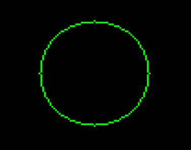
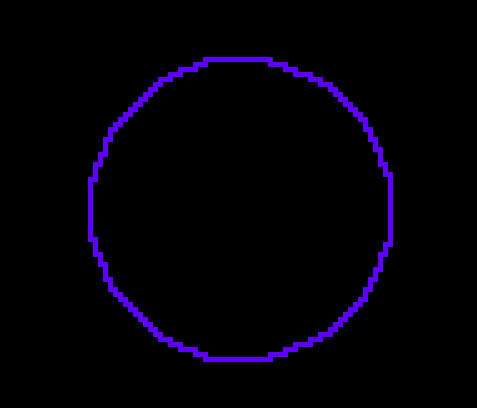
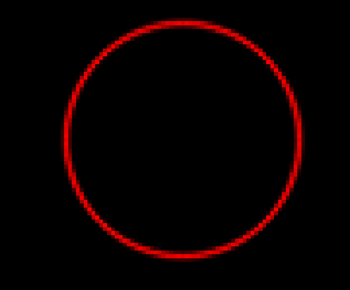
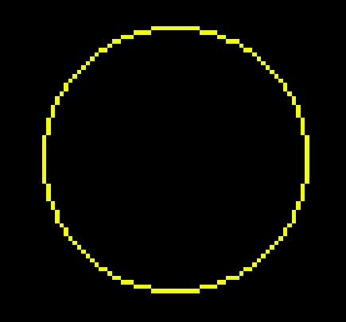
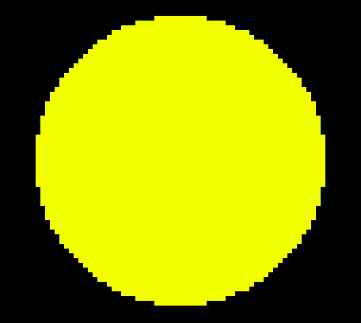

# Exploring Line Types in OpenCV

Recently, while giving a presentation on the basics of OpenCV using Python I came around the various [Line Types](https://www.docs.opencv.org/trunk/d6/d6e/group__imgproc__draw.html#gaf076ef45de481ac96e0ab3dc2c29a777) and it wasn't immediately evident what they meant or what they were used for.
Then, I searched the internet and their too, not much was available directly. 
Hence, I decided to do some experimentation and so here is what I found.

First up is the code:

	# Importing necessary modules
	import cv2
	import numpy as np

	# Create an empty black image of 600px x 600px
	pic = np.zeros((600, 600, 3), np.uint8)

	# Create circles with different centres, colours and line types, 30px radius
	# and 1 px width
	pic = cv2.circle(pic, (100, 100), 30, (0, 255, 0), 1, cv2.LINE_8)
	pic = cv2.circle(pic, (200, 200), 30, (255, 0, 0), 1, cv2.LINE_4)
	pic = cv2.circle(pic, (300, 300), 30, (0, 0, 255), 1, cv2.LINE_AA)
	pic = cv2.circle(pic, (400, 400), 30, (0, 255, 255), 1, cv2.FILLED)

	# Show the image in a window
	cv2.imshow("pic",pic)

	# Wait for any key to be pressed
	cv2.waitKey(0)

	# Save the image
	cv2.imwrite("line_test.png",pic)

I have explained each line in comments so I won't be talking much about the code now. Rather, we shall dicuss the result which is this:

In the first glance, you won't be able to tell any difference between the circles apart from their colours. So let's zoom in into each of the circle.

This is the circle generated by the cv2.LINE_8 option, which is the default option. It's called a 8-connected line. 

Upon deeper research, I found that this LineType argument actually species the line drawing algorithm/pixel connectivity that should be used for creating the line. So LINE_8, or 8-connected line, means that this line was created by using the [Bresenham's line algorithm](https://en.wikipedia.org/wiki/Bresenham%27s_line_algorithm) with [8-connected pixel connectivity](https://en.wikipedia.org/wiki/Pixel_connectivity#8-connected). This means that for every pixel, it's all the 8 surrounding pixels are considered a neighbour. And it's because of that, that we see a bit of a point, the diagonal pixel, at the 4 coordinates that lie on the axis (considering the centre as origin).

This concept is closely related to [Moore Neighborhood](https://en.wikipedia.org/wiki/Moore_neighborhood) which is used in the famous [Conway's Game of Life](https://en.wikipedia.org/wiki/Conway%27s_Game_of_Life).

Now this here is a 4-connected line. Very very similar to 8-connected line, only that now you have only the 4 adjacent pixels as your neighbour. Also knon as [
4 connected pixel connectivity](https://en.wikipedia.org/wiki/Pixel_connectivity#4-connected) this concept is closely related to [Von Neumann neighborhood](https://en.wikipedia.org/wiki/Von_Neumann_neighborhood)

This one though is a different thing altogether. It's an antialiased line. The two above were aliased lines. It is made using the [Xiaolin Wu's line algorithm](https://en.wikipedia.org/wiki/Xiaolin_Wu%27s_line_algorithm). What basically happens is that after drawing the normal line, we paint the neighbouring pixels a shade of the colour and the shade is proportional to the distance from the actual line which you might observe in the pic.

Now I don't know what this is. From the name, it should fill the circle but it isn't doing that. In fact from the looks of it, it is the 4-connected line again. Naturally I wasn't satisfied and dug a bit deeper. I printed it's value cause apparantly all these constants are just integers. So we got:

- cv2.FILLED = -1
- cv2.LINE_4 = 4
- cv2.LINE_8 = 8
- cv2.LINE_AA = 16

And it turns out that FILLED is useful when passed as the thickness parameter cause anything below 1 will fill the shape:

	pic = cv2.circle(pic, (400, 400), 30, (0, 255, 255), cv2.FILLED, cv2.FILLED)

And so ends my experiment. I think I know enough about the LineType argument. And by the way, now that I think about it, we were taught the Bresenham algorithm and 4 and 8-connected pixels as part of the Computer Graphics course in our last semester.

Sorry, couldn't find a relatable comic this time. So here is my life summed up:

