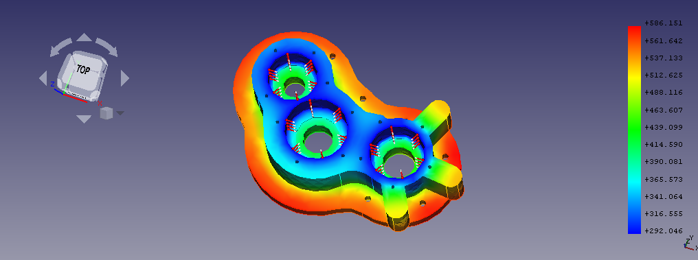

% GSoC Days: Week 15

Another week, another example. This time it was the first one from the [Elmer GUI Tutorials](https://www.nic.funet.fi/pub/sci/physics/elmer/doc/ElmerTutorials.pdf), Heat equation - Temperature field of a solid object. The idea is simple here too, we have a solid object which is getting internally heated, i.e the source of heat is inside the object or the object itself. Additionally, there are fixed temparature on some boundaries/faces. And this how the result will look:

And no, sorry to ruin your hope like this but I can't program such a complex geometry just yet. In fact not even the Elmer people have coded it. It is a step (.stp) file which is kindly provided at the AIM@SHAPE Shape Repository by INRIA. So I have just imported that file in FreeCAD. Then after applying all the relevnt constraints, assigning the material, meshing the model and solving the equations we get the result which was really close to the one mentioned in the tutorial.
One strange thing about this example was that when I made a finer mesh, the result was incorrect. As in the the max temparature went higher than the correct one.
This was strange because usually with a finer mesh you get a more accurate result but that also increases the size of the mesh. So thats a tradeoff you need to make between the file size and result accuracy.

Apart from that, HoWil was ready with an implementation of the `freetextinput` in the laminar flow example to add custom boundary conditions. I tried to adapt that in my example and even though the results did improve but I think that they still didn't matched with the results from the tutorial. Also, the `freetextinput` was not working properly when I used it with the FreeCAD standard mm/k/s units. Maybe some improvements were still required.

And since we were studying heat earlier on, let's have a look at the temparature timeline of the earth:

