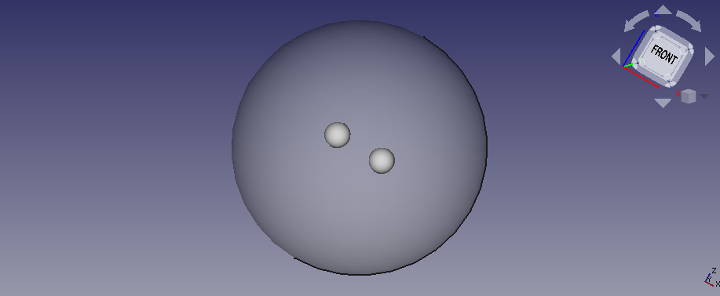

% GSoC Days: Week 9

I passed the first evaluation of GSoC 2020 and as July started, I was given a new example to work on.
This was another from the [Elmer tutorials](https://www.nic.funet.fi/pub/sci/physics/elmer/doc/ElmerTutorials.pdf) (page 28) and another example of electrostatics.
This was another visually appealing example.
And as always, the idea is simple. You have two small perfectly conducting balls in free space. To simulate this free space, we make a larger sphere around the smallspheres and give it the property of air.
The two balls have a voltage difference between them, which results in electric charge being introduced in the system. The model looks like this:

But when I opened the file created by HoWil, it crashed my FreeCAD with a [segmentation fault](https://en.wikipedia.org/wiki/Segmentation_fault). This usually happens when the software tries to access a memory address not allocated to it.
I later found out that the culprint was the post processing plane. So because of the crash, I wasn't properly able to analyse this example. So Bernd suggested me to use FreeCADCmd, the command line version of FreeCAD with only the python console, to extract the required information.
This was a cool idea and I was finally able to get the example coded, though there were errors with mesh and I had to later set the vaccum permittivity to `1 F/m` using the newly developed `ConstantVaccumPermittivity` object.

## Errors in Beam Hinged Example

Remember the beam hinged example we made in the initial days? Yeah the second example. When Bernd tried to run it, he found that the faces were wrongly assigned.
So he corrected that and sent me a pull request. But when I tried to test his PR, I found that the faces were wrongly asigned in his PR and were correct in my example.
It looked as if the names of the faces were changing dynamically cause it's name we use to assign constraints.
We resolved this issue later on.

## Z88 Testing Framework

Bernd had recently improved Calculix's testing framework and was working on Elmer's testing framework. This left the third solver, Z88 for me.
The idea was to take inspiration from Calculix's testing framework and create one for Z88. Cool.
It wasn't really required, but I decided to install Z88 cause that way I can even test the results of the example that it can run.

To my surprise, there was no package for Z88 in Arch Linux. Not even as an AUR. So I had to get to their [github repo](https://github.com/LSCAD/Z88OS).
To my bigger surprise, it's a rather old and unmaintained repo. Especially the way they have different Makefiles for Windows, Linux and Mac. It would be better to use CMake. Well, one of these days I am going to contribute that to them and that's whhy I joined their Forum. Well that's the good thing about open-source softwares though there is the related danger too:

(Trivia: [xkcd fans gifted an actual katana to Richard Stallman](https://blog.xkcd.com/2007/04/19/life-imitates-xkcd-part-ii-richard-stallman/))
